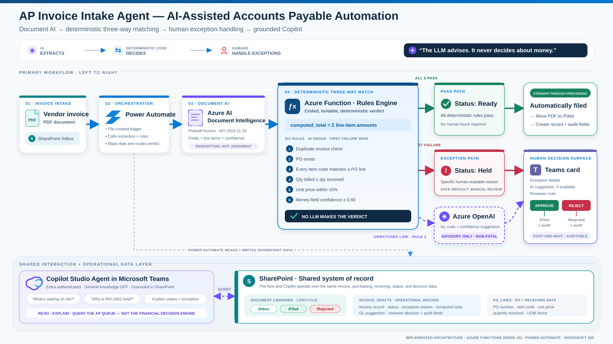

# AP Invoice Intake Agent
**Second Place Winner - Best Copilot Integration - VSLive! Microsoft AI Hackathon 2026 — Solo build**

> **Design principle: the LLM advises, it never decides about money.**

An accounts-payable intake agent that watches a SharePoint inbox, extracts vendor invoices with Azure AI Document Intelligence, three-way-matches them against PO and receiving data with a **determi[...]

## Team

- **Solo**
- Kenny Yukich ([@KtrainUSA503](https://github.com/KtrainUSA503))
- Team name: The Guy with the Monitor 

## Category

- **Primary:** Best Microsoft Copilot Integration
- **Secondary:** Best AI Agent / Workflow Automation

## Demo

▶️ **[Watch the demo video](Video%20Project%207_compressed.mp4)** — committed to this repo (24 MB; GitHub won't preview it inline, click **View raw** to download and play).

---

## The problem

In many small and mid-size companies, AP invoice intake is still a person reading PDFs out of an email inbox, re-keying line items, and eyeballing them against purchase orders in an ERP. It's slow[...]

## Architecture



<details>
<summary>Text architecture outline</summary>

```
SharePoint /Inbox (PDF dropped)
        │  trigger: file created (Power Automate)
        ▼
Azure AI Document Intelligence  (prebuilt-invoice, v4.x, API 2024-11-30)
        │  structured fields + per-field confidence
        ▼
Azure Function "extract"  ◄── the coded web service
  6 deterministic match rules (no model in the decision path)
        │
   pass │            │ fail
        ▼            ▼
  status: Ready   status: Held
  file → /Filed     │ line has no PO match? → Azure OpenAI proposes
  (autonomous)      │   a GL code + confidence  (ADVISORY ONLY)
                    ▼
              Teams adaptive card — Approve / Reject + note
               approve → /Filed + audit row
               reject  → /Rejected + audit row

Copilot Studio agent (Teams, Entra auth, general knowledge OFF)
  reads Invoice_Drafts + PO_Lines: "what's waiting on me?" / "why is
  INV-1002 held?" / conversational approve
```

Two surfaces sit on the same data: the **adaptive card** is push (fires once, waits for one decision) and the **Copilot Studio agent** is pull (answers on demand).

</details>

## The six rules

| # | Rule | Why it exists |
|---|------|---------------|
| 1 | Invoice number not already processed | Duplicate-payment prevention |
| 2 | PO exists | No PO, no pay |
| 3 | Every invoice line matches a PO line by item code | Catches surprise charges (freight, fees). The **only** rule that triggers an LLM call — an advisory GL-code suggestion |
| 4 | Qty billed ≤ qty received | Three-way match against receiving |
| 5 | Unit price within ±5% of PO price | Price-creep detection |
| 6 | Extraction confidence ≥ 0.80 on money fields | If the extractor isn't sure, a human looks |

First failure wins; the invoice Holds with a specific, human-readable reason.

## Why the total is computed, not extracted

Testing showed `prebuilt-invoice` extracts `InvoiceTotal` at only **~41% confidence** on zero-tax invoices (where subtotal = total, the model hedges), while line items extract at **92–98%**. A c[...]

Second finding: `prebuilt-invoice` **silently merges multi-invoice PDFs** into one cross-contaminated document rather than returning an array. Mitigation: the `Pages` parameter on the v4.x connect[...]

## Safety & security

- **No model in the money path.** All pass/fail is deterministic code; the LLM output is a labeled *suggestion* that a human must approve before it touches any record.
- **Advisory failure is non-fatal.** If the Azure OpenAI call errors, the invoice still Holds and routes to a human — degradation, not failure.
- **Secrets in App Settings.** `AOAI_ENDPOINT`, `AOAI_KEY`, `AOAI_DEPLOYMENT` live as Azure environment variables; nothing in this repo contains a credential. Function access is key-gated (`authLe[...]
- **Copilot Studio agent runs with general knowledge OFF** and Entra authentication — it answers only from the grounded SharePoint data.
- **Synthetic data only.** All vendors, POs, and the bill-to company are fictional.

## Stack

Azure Functions (Node.js) · Azure AI Document Intelligence · Azure OpenAI · Power Automate · SharePoint · Microsoft Teams (adaptive cards) · Copilot Studio

## Repo map

```
azure-function/extract/   the deployed rules engine (index.js + bindings)
power-automate/           flow design: trigger → DI → mapping → function → routing
tests/                    the two verified smoke-test payloads (Ready path, Held path)
docs/                     architecture notes and demo script
fixtures/                 synthetic invoice PDFs + PO seed data
```

## Known limitations

Being honest about what's not done:

- **Single currency, no tax logic.** All fixtures are zero-tax USD invoices; tax lines and multi-currency would need new rules, not just new data.
- **Unit-of-measure conversion is schema-ready but not enforced.** `PO_Lines` carries a `uom_factor` column; the rules engine doesn't apply it yet.
- **The Copilot Studio agent reads and explains the queue; conversational *approve* is partially wired.** Approval is fully functional through the Teams adaptive card path.
- **The ±5% price tolerance and 0.80 confidence threshold are hard-coded.** In production these belong in configuration an AP manager can own.
- **No retry/poison-queue handling** if the flow fails mid-run — the PDF simply stays in `/Inbox` for reprocessing, which is safe but manual.

Next steps: finish conversational approval, externalize thresholds, add a vendor-master check (rule 7: is this vendor even one we buy from?), and pilot against the real workflow that inspired it.

## Real-world grounding

Modeled on an actual manual AP workflow (email → OCR tool → ERP) observed in a manufacturing environment — this isn't a toy problem, it's a Tuesday.

---

## About the builder

My background is process, not programming — and that's the point of this project. I'm a Lean / continuous-improvement practitioner who moved
into a tech-adjacent role about six months ago — my background is process, not
programming. Every line of code in this repo was written with AI coding
assistants, at this event, with me directing the architecture, testing every
path, and making every design decision.

That's not a disclaimer — it's the point of the project. The core design
principle ("the LLM advises, it never decides about money") came from process
discipline, not a CS degree. If AI collapses the distance between someone who
deeply understands a workflow and working software, then the people who
understand the workflows are about to become builders. This repo is one data
point.

---

*Built solo in ~8 hours across two evenings at Microsoft HQ, Redmond. MIT licensed.*
